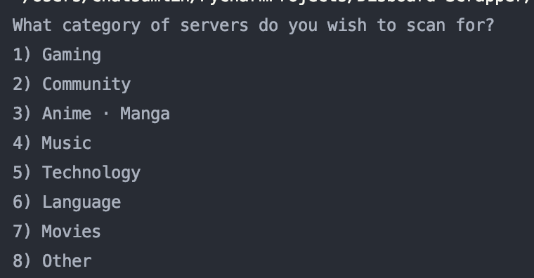

# DISBOARD-scraper
This python script will get data on a category of servers of your choosing!

## Installation
 - Make sure you have Python 3.6< installed
 - Clone this repository
 - Run `main.py`
 
 The script will ask you what type of servers you want to scan for, you should input the number of the category you want to use **not** the name.
 
 It will then save the data to a csv titled "[Category Name] servers.csv"

Happy scrapping :)

